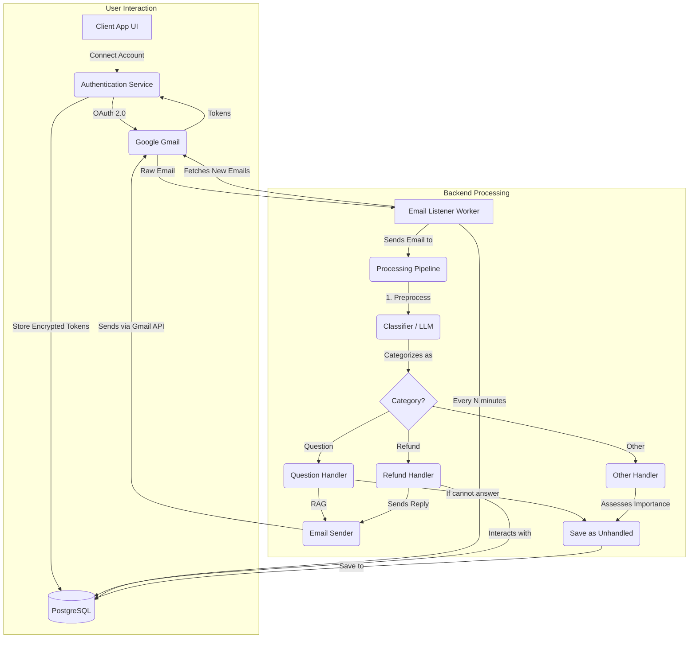

# AI Customer Support Email Agent

An automated email agent that uses AI to categorize, process, and respond to customer support emails. The agent can answer questions using a Retrieval-Augmented Generation (RAG) system, handle stateful refund requests, and classify other emails for manual review.

## Features

-   **Automatic Email Categorization**: Classifies incoming emails into `Question`, `Refund`, or `Other`.
-   **RAG-Powered Q&A**: Answers user questions by retrieving relevant information from a local knowledge base (`faq.txt`).
-   **Stateful Refund Processing**: Manages refund requests by checking a database, asking for missing information, and logging invalid attempts.
-   **Secure Gmail Integration**: Connects to Gmail accounts using OAuth 2.0 and stores credentials securely using encryption.
-   **Database Integration**: Uses PostgreSQL to manage orders, unhandled emails, and user credentials.
-   **Minimalist Web UI**: A simple Flask web interface for connecting and disconnecting Gmail accounts.

## Tech Stack

-   **Backend**: Python
-   **Web Framework**: Flask
-   **Database**: PostgreSQL
-   **AI / RAG**: LangChain, Hugging Face Transformers, Sentence-Transformers, FAISS
-   **Email API**: Google Gmail API
-   **Containerization**: Docker, Docker Compose
-   **Security**: `cryptography`

## Architectural Overview

The system is composed of a web application for account management and a background listener for email processing.



## Project Structure

-   `run_listener.py`: The main entry point for the background worker. Manages the main loop for fetching and processing emails.
-   `processing_service.py`: The core logic pipeline. Orchestrates the categorization and handling of emails.
-   `llm_service.py`: Contains all AI-related logic, including email categorization and the RAG implementation.
-   `gmail_service.py`: A wrapper for all interactions with the Google Gmail API.
-   `database.py`: Manages the database connection and schema setup.
-   `security.py`: Handles the encryption and decryption of user credentials.
-   `app.py`: A simple Flask web app used only for the OAuth 2.0 flow.
-   `Dockerfile` & `docker-compose.yml`: Defines the containerized environment.

---

## Getting Started

### Prerequisites

-   Python 3.9+
-   Docker and Docker Desktop
-   A Google Cloud Platform account

### 1. Google Cloud & Gmail API Setup

1.  **Create a Google Cloud Project** and **Enable the Gmail API**.
2.  **Configure OAuth Consent Screen**:
    -   Choose **External**.
    -   **Add Scopes**: `.../auth/gmail.readonly`, `.../auth/gmail.modify`, `.../auth/gmail.send`, `.../auth/userinfo.email`, and `openid`.
    -   **Add Test Users**: Add the Google account(s) you intend to connect. **This is critical for the login to work.**
3.  **Create Credentials**:
    -   Create an **OAuth client ID** for a **Web application**.
    -   Add `http://localhost:5000/oauth2callback` and `http://127.0.0.1:5000/oauth2callback` as authorized redirect URIs.
    -   **Download the JSON** and save it as `client_secret.json` in the project's root directory.

### 2. Configuration

1.  **Clone the repository**:
    ```bash
    git clone https://github.com/ioa2205/email-support-agent.git
    cd email-support-agent
    ```
2.  **Create a `.env` file**.
3.  **Generate a secret key** for encryption by running this command and copying the output:
    ```bash
    python -c "from cryptography.fernet import Fernet; print(Fernet.generate_key().decode())"
    ```
4.  **Populate the `.env` file**. Use the `.env.example` as a template.

### 3. Running the Application (Recommended: Docker Compose)

1.  **Build and Start the Services**: This will start the database and the email listener in the background.
    ```bash
    docker-compose up --build -d
    ```
2.  **Initialize the Database**: The first time you run the application, create the database tables:
    ```bash
    docker-compose exec app python database.py
    ```
3.  **Connect a Gmail Account**:
    -   Run the local Flask web app to handle the browser-based login.
    -   In a terminal (with your `.venv` activated), run:
        ```bash
        pip install -r requirements.txt
        python app.py
        ```
    -   Navigate to `http://127.0.0.1:5000` in your browser and connect your account.
    -   Once connected, you can stop the `app.py` server (`Ctrl+C`).

4.  **View Logs**: To see the live activity of the email agent, stream the logs:
    ```bash
    docker-compose logs -f app
    ```

### 4. How to Test

Once the listener is running, send emails to the connected Gmail account from another address:
-   **Question**: Subject: "Help", Body: "How do I reset my password?"
-   **Refund (Valid)**: Subject: "Refund", Body: "My order ID is ORD12345."
-   **Refund (Invalid)**: Subject: "Money Back", Body: "The order ID is ORD99999."

---

## Future Improvements

This project is a robust prototype. To make it fully production-ready, the following steps could be taken:

-   **Scalability**: Replace the simple `time.sleep` loop in `run_listener.py` with a distributed task queue like **Celery** and **Redis** to process emails for thousands of accounts in parallel.
-   **Automated Testing**: Implement a test suite with `pytest` to include unit tests for business logic and integration tests for the email processing pipeline.
-   **Enhanced AI**: Upgrade the RAG system to use a more powerful generative model (like a fine-tuned T5 or a commercial LLM API) for more fluid and comprehensive answers.
.