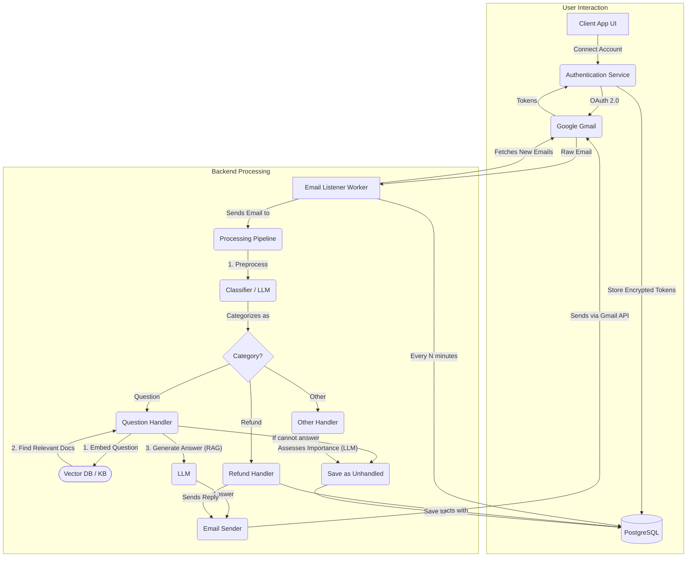

# AI Customer Support Email Agent

An automated email agent that uses AI to categorize, process, and respond to customer support emails. The agent can answer questions using a Retrieval-Augmented Generation (RAG) system, handle refund requests through a database, and classify other emails for manual review.

## Features

-   **Automatic Email Categorization**: Classifies incoming emails into `Question`, `Refund`, or `Other`.
-   **RAG-Powered Q&A**: Answers user questions by retrieving relevant information from a local knowledge base (`faq.txt`).
-   **Stateful Refund Processing**: Manages refund requests by checking an order database, asking for missing information, and logging invalid attempts.
-   **Gmail Integration**: Securely connects to one or more Gmail accounts using OAuth 2.0 to listen for and reply to emails.
-   **Database Integration**: Uses PostgreSQL to manage orders, unhandled emails, and user credentials.
-   **Minimalist Web UI**: A simple Flask web interface for connecting and disconnecting Gmail accounts.

## Tech Stack

-   **Backend**: Python
-   **Web Framework**: Flask
-   **Database**: PostgreSQL
-   **Containerization**: Docker, Docker Compose
-   **AI / RAG**: LangChain, Hugging Face Transformers, Sentence-Transformers, FAISS
-   **Email API**: Google Gmail API
-   **Containerization**: Docker

## Architectural Overview

The system is composed of two main parts: a web application for account management and a background listener for email processing.



## Setup and Installation

### Prerequisites

-   Python 3.9+
-   Docker and Docker Desktop
-   A Google Cloud Platform account

### 1. Google Cloud & Gmail API Setup

Before running the application, you need to configure your Google Cloud project and get credentials.

1.  **Create a Google Cloud Project**: Go to the [Google Cloud Console](https://console.cloud.google.com/) and create a new project.
2.  **Enable the Gmail API**: In your project, go to "APIs & Services" > "Library", search for "Gmail API", and enable it.
3.  **Configure OAuth Consent Screen**:
    -   Go to "APIs & Services" > "OAuth consent screen".
    -   Choose **External** and fill in the required app details.
    -   **Add Scopes**: Add `.../auth/gmail.readonly`, `.../auth/gmail.modify`, `.../auth/gmail.send`, `.../auth/userinfo.email`, and `openid`.
    -   **Add Test Users**: Add the Google account(s) you intend to connect. **This is critical for the login to work in testing mode.**
4.  **Create Credentials**:
    -   Go to "APIs & Services" > "Credentials".
    -   Click "+ Create Credentials" > "OAuth client ID".
    -   Select **Web application**.
    -   Add `http://localhost:5000/oauth2callback` and `http://127.0.0.1:5000/oauth2callback` as authorized redirect URIs.
    -   Click **Download JSON** and save the file as `client_secret.json` in the project's root directory.

### 2. Configuration

The application uses environment variables for configuration.

1.  **Create a `.env` file** in the project root.
2.  **Generate a secret key** for encrypting credentials. Run this command in your terminal and copy the output:
    ```bash
    python -c "from cryptography.fernet import Fernet; print(Fernet.generate_key().decode())"
    ```
3.  **Populate the `.env` file** with your database settings and the keys you've generated.

    **.env.example:**
    ```
    # PostgreSQL Database Configuration
    DB_NAME=email_agent
    DB_USER=postgres
    DB_PASSWORD=mysecretpassword
    DB_HOST=localhost
    DB_PORT=5432

    # Application Encryption Key
    ENCRYPTION_KEY="your-generated-encryption-key-goes-here"
    ```

### 3. Running the Application

This project is fully containerized with Docker Compose for easy setup.

1.  **Build and Start the Services**: This will build the Python image and start both the application and database containers in the background.
    ```bash
    docker-compose up --build -d
    ```
2.  **Initialize the Database**: The first time you run the application, you need to create the database tables. This command runs `database.py` inside the running `app` container.
    ```bash
    docker-compose exec app python database.py
    ```
3.  **Connect a Gmail Account**:
    -   The application listener is now running in the background. To connect an account, run the Flask web app locally.
    -   Open a **new terminal** and run:
        ```bash
        python app.py
        ```
    -   Navigate to `http://127.0.0.1:5000` in your browser and connect your account.
    -   Once connected, you can stop the `app.py` server (`Ctrl+C`).

4.  **View Logs**: To see the live activity of the email agent, you can stream the logs from the running container:
    ```bash
    docker-compose logs -f app
    ```

---

## Project Structure

The project is organized into several modules with a clear separation of concerns:

-   `run_listener.py`: The main entry point for the background worker. Manages the main loop for fetching and processing emails.
-   `processing_service.py`: The core logic pipeline. Orchestrates the categorization and handling of emails.
-   `llm_service.py`: Contains all AI-related logic, including email categorization and the RAG implementation for answering questions.
-   `gmail_service.py`: A wrapper for all interactions with the Google Gmail API.
-   `database.py`: Manages the database connection and schema setup.
-   `security.py`: Handles the encryption and decryption of user credentials.
-   `app.py`: A simple Flask web app used only for the OAuth 2.0 flow to connect and disconnect accounts.
-   `Dockerfile` & `docker-compose.yml`: Defines the containerized environment for the application.

---

## Future Improvements

This project is a robust prototype. To make it fully production-ready, the following steps could be taken:

-   **Scalability**: Replace the simple `time.sleep` loop in `run_listener.py` with a distributed task queue like **Celery** and **Redis**. This would allow the system to process emails for thousands of accounts in parallel.
-   **Automated Testing**: Implement a test suite with `pytest` to include unit tests for business logic (e.g., refund rules) and integration tests for the email processing pipeline.
-   **Enhanced AI**: The current RAG system uses a simple QA model. This could be upgraded to use a more powerful generative model (like a fine-tuned T5 or a commercial LLM API) for more fluid and comprehensive answers.