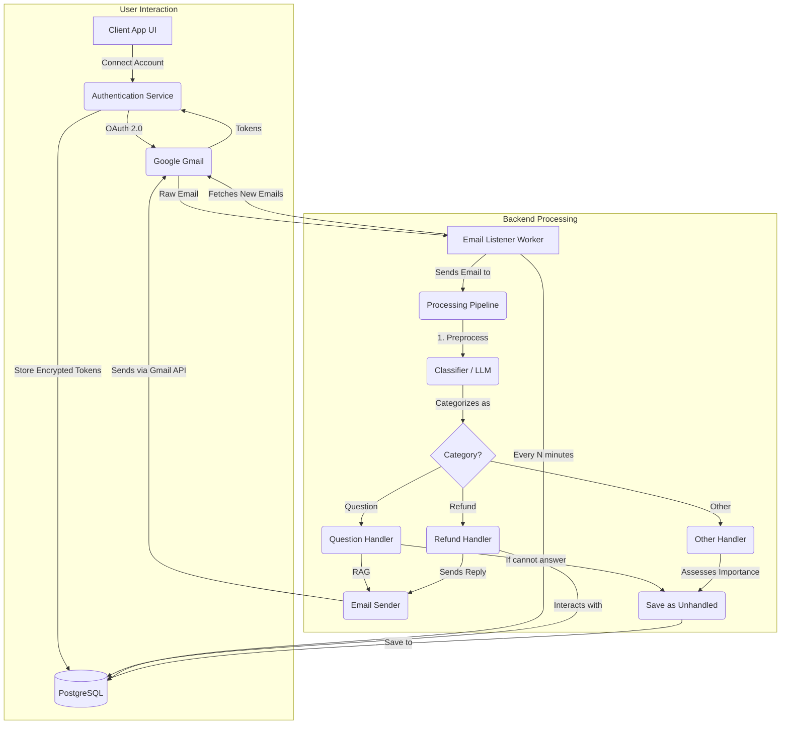

# AI Customer Support Email Agent

An automated email agent that uses AI to categorize, process, and respond to customer support emails. The agent can answer questions using a Retrieval-Augmented Generation (RAG) system, handle stateful refund requests, and classify other emails for manual review.

## Motivation

In many businesses, customer support teams are overwhelmed by a high volume of repetitive emails. This project aims to solve that problem by creating an intelligent agent that can:
- Instantly answer common questions using a knowledge base.
- Handle the initial steps of a refund process automatically.
- Filter out noise, allowing human agents to focus on complex, high-value customer interactions.

## Features

-   **Automatic Email Categorization**: Classifies incoming emails into `Question`, `Refund`, or `Other`.
-   **RAG-Powered Q&A**: Answers user questions by retrieving relevant information from a local knowledge base.
-   **Stateful Refund Processing**: Manages refund requests by checking a database, asking for missing information, and logging invalid attempts.
-   **Secure Gmail Integration**: Connects to Gmail accounts using OAuth 2.0 and stores credentials securely using encryption.
-   **Database Integration**: Uses PostgreSQL to manage orders, unhandled emails, and user credentials.
-   **Minimalist Web UI**: A simple Flask web interface for connecting and disconnecting Gmail accounts.

## Tech Stack

-   **Backend**: Python
-   **Web Framework**: Flask
-   **Database**: PostgreSQL
-   **AI / RAG**: LangChain, Hugging Face Transformers, Sentence-Transformers, FAISS
-   **Email API**: Google Gmail API
-   **Containerization**: Docker, Docker Compose
-   **Security**: `cryptography`

## Architectural Overview

The system consists of a web application for account management and a background listener for email processing.



---

## Getting Started

### Prerequisites

-   Python 3.9+
-   Docker and Docker Desktop
-   A Google Cloud Platform account

### 1. Google Cloud & Gmail API Setup

1.  **Create a Google Cloud Project** and **Enable the Gmail API**.
2.  **Configure OAuth Consent Screen**:
    -   Choose **External**.
    -   **Add Scopes**: `.../auth/gmail.readonly`, `.../auth/gmail.modify`, `.../auth/gmail.send`, `.../auth/userinfo.email`, and `openid`.
    -   **Add Test Users**: Add the Google account(s) you intend to connect. **This is critical for the login to work.**
3.  **Create Credentials**:
    -   Create an **OAuth client ID** for a **Web application**.
    -   Add `http://localhost:5000/oauth2callback` and `http://127.0.0.1:5000/oauth2callback` as authorized redirect URIs.
    -   **Download the JSON** and save it as `client_secret.json` in the project's root directory.

### 2. Local Project Setup & Configuration

1.  **Clone the repository**:
    ```bash
    git clone https://github.com/ioa2205/email-support-agent.git
    cd email-support-agent
    ```
2.  **Create a `.env` file**. This file will hold all your secrets.
3.  **Generate a secret key** for encryption by running this command in your terminal and copying the output:
    ```bash
    python -c "from cryptography.fernet import Fernet; print(Fernet.generate_key().decode())"
    ```
4.  **Populate the `.env` file**. Use the `.env.example` as a template. The `DB_HOST` value is important and depends on how you run the application (see next section).

    **.env.example:**
    ```


    # PostgreSQL Database Configuration
    DB_NAME=email_agent
    DB_USER=postgres
    DB_PASSWORD=mysecretpassword
    DB_HOST=localhost
    DB_PORT=5432

    # Google API Configuration
    GOOGLE_CLIENT_ID="client_id_here.apps.googleusercontent.com" # Replace with your actual client ID
    GOOGLE_CLIENT_SECRET="client_secret_here" # Replace with your actual client secret


    ENCRYPTION_KEY="your_generated_encryption_key_here" # Replace with your actual encryption key

---

## Running the Application

You have two options for running the application.

### Option 1: Using Docker Compose (Recommended)

This method containerizes both the database and the Python application. It is the easiest way to run the entire system with a single command.

1.  **Configure `.env`**: Make sure `DB_HOST` is set to `db` in your `.env` file. Docker Compose will automatically map this hostname to the database container.
2.  **Build and Start the Services**: This command will build the Python image and start both the application and database containers in the background.
    ```bash
    docker-compose up --build -d
    ```
3.  **Initialize the Database**: The first time you run the application, create the database tables:
    ```bash
    docker-compose exec app python database.py
    ```
4.  **Connect a Gmail Account**: See the "Connecting Your Account" section below.
5.  **View Logs**: To see the live activity of the email agent, stream the logs:
    ```bash
    docker-compose logs -f app
    ```

### Option 2: Running Locally with Docker for Database

This method is ideal for development, as it allows you to run your Python code directly on your machine for faster testing, while still using Docker for the database.

1.  **Start the Database Container**: Open a terminal and run this command. Leave it running.
    ```bash
    docker run --rm --name pg-email-agent -e POSTGRES_PASSWORD=mysecretpassword -e POSTGRES_DB=email_agent -p 5432:5432 postgres
    ```
2.  **Configure `.env`**: Make sure `DB_HOST` is set to `localhost` in your `.env` file to connect to the database container.
3.  **Setup Local Environment**: In a new terminal, activate your virtual environment and install dependencies.
    ```bash
    # Create and activate virtual environment
    python -m venv .venv
    .venv\Scripts\Activate.ps1

    # Install packages
    pip install -r requirements.txt
    ```
4.  **Initialize the Database**:
    ```bash
    python database.py
    ```
5.  **Connect a Gmail Account**: See the "Connecting Your Account" section below.
6.  **Run the Email Agent**: Once an account is connected, start the main listener script.
    ```bash
    python run_listener.py
    ```

### Connecting Your Account (Required for Both Options)

The email listener needs credentials to work.
1.  **Run the Flask Web App**: Open a new terminal (with your `.venv` activated) and run:
    ```bash
    python app.py
    ```
2.  **Authenticate in Browser**: Navigate to `http://127.0.0.1:5000` in your browser and connect your Gmail account.
3.  **Stop the Web App**: Once connected, you can stop the `app.py` server (`Ctrl+C`). The credentials are now saved in the database for the listener to use.

---

## Future Improvements

-   **Scalability**: Replace the simple `time.sleep` loop with a distributed task queue like **Celery** to process emails for thousands of accounts in parallel.
-   **Automated Testing**: Implement a `pytest` suite with unit and integration tests.
-   **Enhanced AI**: Upgrade the RAG system to use a more powerful generative model for more fluid answers.